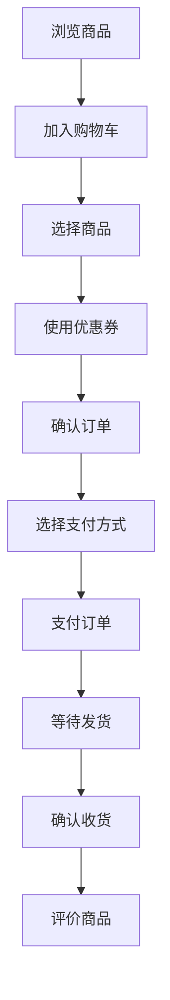
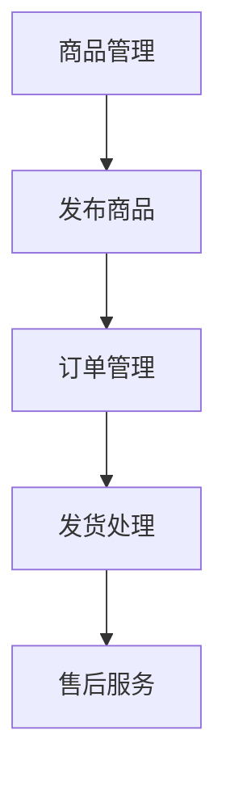
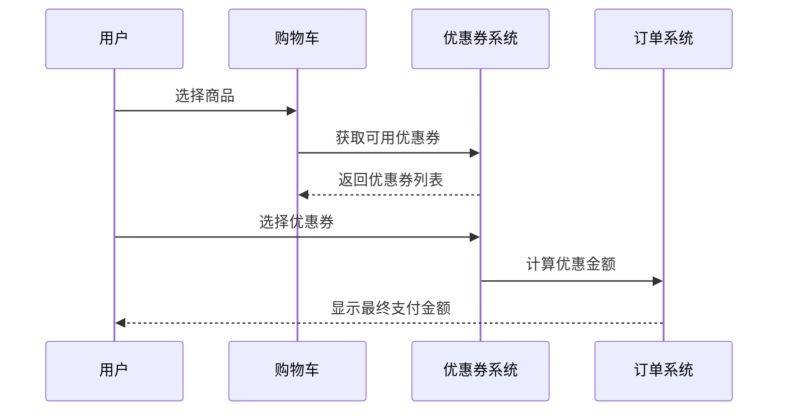

# 软工Ⅱ_南京_第1组_文档Lab5-人机交互设计文档

## 文档作者
- 编写者：[刘柏成]

## 文档修改历史
| 版本号 | 修改日期 | 修改人   | 修改内容 |
| ------ | -------- | -------- | -------- |
| v1.0   | 2025.5.4 | [刘柏成] | 最终版本 |

## 目录
1. [设计背景/思路](#1-设计背景思路)
2. [业务流程](#2-业务流程)
3. [页面交互](#3-页面交互)
4. [全局通用说明](#4-全局通用说明)
5. [废纸篓](#5-废纸篓)

## 1. 设计背景/思路

### 1.1 用户画像

#### 买家用户画像
- **基础信息**
  - 年龄：18-35岁
  - 职业：学生、上班族
  - 消费能力：中等
  - 购物频率：每月3-5次
  
- **用户需求**
  - 快速便捷的购物体验
  - 清晰的商品分类和搜索
  - 优惠券和促销活动
  - 安全可靠的支付系统
  - 便捷的订单管理

#### 卖家用户画像
- **基础信息**
  - 年龄：25-45岁
  - 职业：个体商户、小型企业主
  - 经营规模：小型到中型
  
- **用户需求**
  - 简单的商品管理系统
  - 订单处理和物流管理
  - 营销工具和数据分析
  - 客户服务支持

### 1.2 竞品分析
1. **淘宝/天猫**
   - 优点：功能丰富，生态完善
   - 缺点：界面较为复杂，信息密度高
   
2. **京东**
   - 优点：界面清晰，物流快速
   - 缺点：商品种类相对较少
   
3. **拼多多**
   - 优点：价格优势，社交化购物
   - 缺点：商品质量参差不齐

我们的优势：
- 界面简洁清晰
- 操作流程优化
- 专注核心购物体验
- 优惠券使用便捷

## 2. 业务流程

### 2.1 买家购物流程


### 2.2 卖家业务流程


## 3. 页面交互

### 3.1 产品结构
```
TomatoMall
├── 用户中心
│   ├── 个人信息
│   ├── 订单管理
│   └── 优惠券管理
├── 商品
│   ├── 商品列表
│   ├── 商品详情
│   └── 商品搜索
├── 购物车
│   ├── 商品列表
│   └── 结算中心
└── 订单
    ├── 确认订单
    ├── 支付
    └── 订单详情
```

### 3.2 信息结构
```
商品信息
├── 基本信息
│   ├── 商品ID
│   ├── 商品名称
│   ├── 价格
│   └── 库存
├── 详细信息
│   ├── 描述
│   ├── 规格
│   └── 图片
└── 营销信息
    ├── 优惠券
    └── 促销活动
```

### 3.3 操作流程图
#### 优惠券使用流程


### 3.4 原型图
[使用优惠券支付界面原型图将在后续补充]

## 4. 全局通用说明

### 4.1 常用控件
- **按钮样式**
  - 主要按钮：#FF6B6B
  - 次要按钮：#4ECDC4
  - 禁用状态：#CCCCCC

- **导航栏**
  - 高度：60px
  - 背景色：#FFFFFF
  - 文字颜色：#333333

- **列表样式**
  - 间距：16px
  - 圆角：8px
  - 边框：1px solid #EEEEEE

### 4.2 复用组件
- 商品卡片组件
- 优惠券展示组件
- 订单信息组件
- 支付确认弹窗

### 4.3 单位规范
- **时间显示**
  - 今天内：HH:mm
  - 昨天：昨天 HH:mm
  - 一周内：周几 HH:mm
  - 更早：YYYY-MM-DD HH:mm

- **金额显示**
  - 整数：¥100
  - 小数：¥99.99
  - 折扣：9.5折
  - 优惠：-¥10

### 4.4 缺省页
- **网络错误**
  - 图标：断开的信号
  - 文案：网络连接失败，请检查网络设置

- **空数据**
  - 购物车空：暂无商品，去逛逛吧
  - 订单空：还没有订单记录
  - 优惠券空：暂无可用优惠券

- **加载中**
  - 动画：旋转的番茄图标
  - 文案：加载中...
